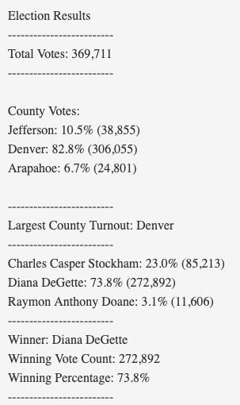

# Election_Analysis

## Project Overview
A Colorado Board of Elections employee has asked us to complete an election audit to analyze the outcomes of a recent local election. In the audit, we are to calculate the total number of votes cast, find which candidates and counties received votes, calculate the total number of votes each candidate and county obtained, determine the percentage of the total votes each county and candidate received, find the county with the largest candidate turnout, and finally to decide upon the winning candidate based on the popular vote. 

# Resources
- Data Souce: election_results.csv
- Software: Python 3.8.8, Visual Studio Code, 1.59.1

## Results 
Based on our analysis of the election_results.csv, the election shows that.
- There were 369,711 total votes cast in this congressional election. This was found by counting every row in our data sheet as each row represents one vote cast. To do this we put the following statement in our code beneath a for loop: 

'''

    total_votes = total_votes + 1
     
'''

- The county results were:
    - The counties that participated in the election were Jefferson, Denver, and Arapahoe.
    - Jefferson county received 10.5% of the total votes with 38,855 votes cast. 
    - Denver county received 82.8% of the total votes with 306,055 votes cast.
    - Arapahoe recieved 6.7% of the total votes with 24,801 votes cast. 
- To find the county names and the total number of votes they recieved, first the county name was added to a county list if it was a new name that had not appeared in the list with the for loop that was looping through all rows in the data sheet. Outside of this if statment as we are still looping through all rows, everytime a candidate name is mentioned, the value associated with the name key is increased by one in the county votes dicitonary. 

'''

    if county_name not in county_list:
        candidate_list.append(county_name)
        county_votes[county_name] = 0
    county_votes[county_name] += 1

'''

Following finding of how many votes each county obtained, the percentage of the total vote each county received was found by dividing the county votes by the total votes found earlier and multipling by 100. 

'''

    for county_name in county_votes:
        ctyvote = county_votes[county_name]
        ctyvotepercentage = float(ctyvote) / float(total_votes) *100
        county_results = (f"{county_name}: {ctyvotepercentage:.1f}% ({ctyvote:,})\n")

'''

- The county with the largest number of votes and largest turnout was therefore Denver county with 82.8% of the votes and 306,055 votes cast. 
- The candidate results were:
    - The candidates to receive votes in this election were Charles Casper Stockham, Diane Degette, and Raymon Anthony Doane. 
    - Charles Casper Stockham received 23.0% of the total votes with 85,213 votes.
    - Diana DeGette received 73.8% of the total votes with 272,892 votes.
    - Raymon Anthony Doane received 3.1% of the total votes with 11,606 votes.
The finding of the candidate results were conducted similary to the findings of the county results but the candidate specific variables and lists were used. 

- The winner of the election was Diane Degette based off her winning the popular with 73.8% of votes and 272,892 votes cast for her. 
- These results were summarized in a txt file to compile our findings. 

## Summary
Election-Audit Summary: In a summary statement, provide a business proposal to the election commission on how this script can be used—with some modifications—for any election. Give at least two examples of how this script can be modified to be used for other elections.

This election audit was compiled to find election results for various counties and candidates in one congressional district. The code can be useful for various congressional elections just by making a few changes depending on the type of audit you want to run. If another election commision from a different district wants to find the same information with a similar csv file of data all that needs to be done is changing the data we are referencing in our script. In our current script we use the following code to reference our data sheet:

'''

    file_to_load = os.path.join("Resources", "election_results.csv")
    
'''
All that would need to be changed would be the path to the file inside of the parenthesis and the results would be found for another district. It may also be beneficial to change the text file you are printing the results to but this is not necessary. 

Another beneficial aspect of this code is that it can easily be modified in order to find the results of another variable as long as the data sheet provides that information. For example, if your data sheet had a column that provided political party information for each vote, you can change your variables to reference a different column and a list and number of votes for each different option will be listed. In order to do this you would just need to change the row you are referencing such as in our candidate analysis: 

'''

    candidate_name = row[2]
    
'''

If we were referencing column 5, we would need to change our index to 4. You would then want to change your variable to match the situation for which you are testing. You could also just add this information if you did not want to rid of the other columns that are being tested for. 

With so many possibilities for election audits in this script it is sure to be a beneficial tool in many upcoming congressional elections. 
